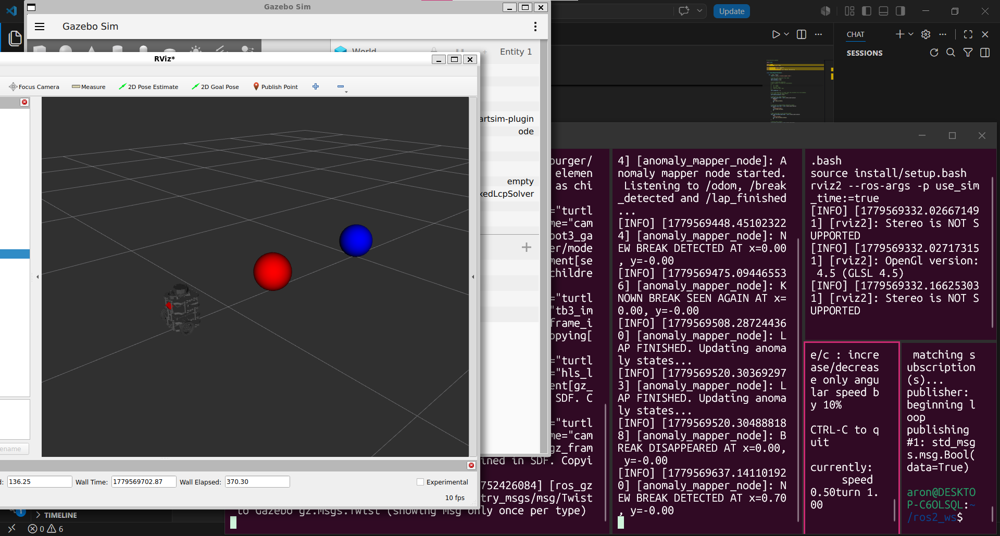

# KogRob_Project

## Project Demonstration Video

You can watch the demo video of the project here: https://youtu.be/txEczfp6hIs

## Simulation - simulation_bringup_line_follow.launch.py

## Line following and break detecting - break_detector_NN

## Gazebo World - palya_final.sdf

The map used in the simulation contains a white ground, and many movable flat black boxes. These boxes has no collision, therefore the robot does not
collide with the boxes, only sees them as a black line.

With manually moving the shorter boxes, we can create and remove breaks in the track while the robot is still moving.

## Lap Detector Module - 'lap_detector_node'

The purpose of the lap detector node is to detect when the robot has completed a full lap.
The node publishes this information to a topic and also keeps track of the completed lap count in the terminal output.

In the node's code, we can define a rectangular area that acts as the start/finish zone.
Whenever the robot enters this area, the node registers a completed lap.
The robot's current position is obtained from the `/odom` topic and continuously monitored.

When the robot completes a lap, the node publishes a `True` boolean value to the `/lap_finished` topic,
which is then read by the anomaly mapper node.

## Project Mapping Module — `anomaly_mapper_node`

The purpose of the `project_mapping` module is to visualize and track detected line breaks/anomalies during line following in RViz.

The `anomaly_mapper_node` monitors:

- the robot’s current position (`/odom`),
- the break detector output (`/break_detected`),
- and lap completion events (`/lap_finished`).

The node stores the positions of detected anomalies and publishes them as RViz markers.

### Operation

When the `/break_detected` topic publishes `True`:

1. The node reads the robot’s current position and orientation.
2. It calculates the estimated break position in front of the robot camera.
3. It checks whether a previously known anomaly already exists nearby.
4. If no nearby anomaly exists:
   - a new anomaly is created.
5. If a nearby anomaly already exists:
   - the existing anomaly is reactivated.

The anomaly states are updated after each completed lap.

The `/lap_finished` topic signals the end of a full lap. At this point:

- anomalies that were not detected again during the current lap
  become inactive.

This allows the system to distinguish between:

- currently active line breaks,
- and previously detected but disappeared anomalies.

### RViz Marker Colors

| Color | Meaning |
|---|---|
| 🔴 Red | Active / currently visible anomaly |
| 🔵 Blue | Previously detected but disappeared anomaly |

### Used Topics

#### Subscribed Topics

| Topic | Type | Purpose |
|---|---|---|
| `/odom` | `nav_msgs/Odometry` | Robot position and orientation |
| `/break_detected` | `std_msgs/Bool` | Break detection signal |
| `/lap_finished` | `std_msgs/Bool` | End-of-lap signal |

#### Published Topic

| Topic | Type | Purpose |
|---|---|---|
| `/anomaly_markers` | `visualization_msgs/MarkerArray` | RViz marker visualization |

### Testing

The module was tested manually using ROS2 topic publishing.

Example break simulation:

```bash
ros2 topic pub /break_detected std_msgs/msg/Bool "{data: true}" --once
```

Lap completion simulation:

```bash
ros2 topic pub /lap_finished std_msgs/msg/Bool "{data: true}" --once
```

The robot was controlled using `teleop_twist_keyboard`.

### RViz Test During Development

The following screenshot shows the anomaly tracking system during manual RViz testing.

The red marker represents an active anomaly,
while the blue marker represents a previously detected but currently disappeared anomaly.



### Used ROS Packages

| ROS2 Package | Links |
|---|---|
| `rclpy` | https://docs.ros.org/en/iron/p/rclpy/ |
| `nav_msgs` | https://wiki.ros.org/nav_msgs |
| `std_msgs` | https://wiki.ros.org/std_msgs |
| `visualization_msgs` | https://wiki.ros.org/visualization_msgs |
| `sensor_msgs` | https://wiki.ros.org/sensor_msgs |
| `geometry_msgs` | https://wiki.ros.org/geometry_msgs |
| `cv_bridge` | https://wiki.ros.org/cv_bridge |
| `turtlebot3` | https://wiki.ros.org/turtlebot3 |
| `turtlebot3_msgs` | https://wiki.ros.org/turtlebot3_msgs |
| `turtlebot3_simulations` | https://wiki.ros.org/turtlebot3_simulations |
| `ros_gz_sim` | https://index.ros.org/p/ros_gz_sim/ |
| `rosgraph_msgs` | https://wiki.ros.org/rosgraph_msgs |
  
### External Repositories

MOGI ROS educational repository:

https://github.com/MOGI-ROS/Week-1-8-Cognitive-robotics
